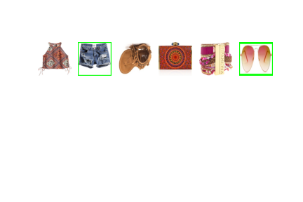
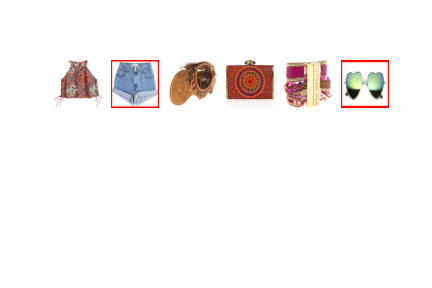

# find_incompatibility_item

## 목표
outfit에서 어울리지 않는 item k개를 찾아서 나머지 item들과 어울리는 item으로 교체해준다.

### TODO
1. dataset 준비
  * 기존의 outfit을 구성하는 item들 중에서 50%를 넘지 않는 선에서 random하게 k개의 item을 선택한다.
  * 선택된 item은 negative item으로 대체되어진다.
    **negative item의 조건**
    1. negative item은 outfit을 구성하는 나머지 item들과 다른 outfit에서 단 한번도 함께 등장하지 않은 item이어야한다.
    2. negative item은 선택된 item과 같은 category를 갖고 있어야한다.
  * negative item으로 대체한다.
  * negative item으로 교체된 outfit data의 image를 저장한다. (결과 확인)
  
2. 참고할 code/논문 준비
  * Polyvore dataset을 사용
  * Transformer 구조를 사용

3. 구현
4. 결과 확인

  **Positive outfit**
  
   

  **Negative outfit**
  
   
